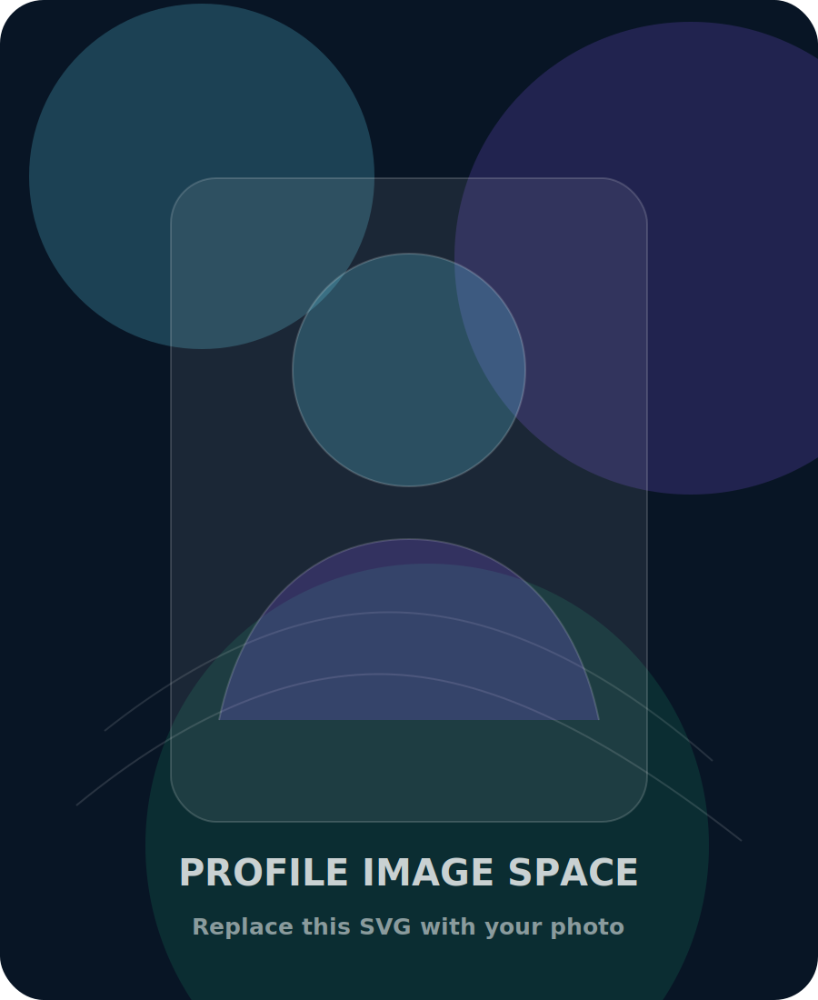

# Ahamed Sowkey Portfolio Website

This is a complete static portfolio website built with HTML, CSS, and JavaScript.

## Files

- `index.html` — page structure and portfolio content
- `styles.css` — responsive styling, layout, animations, dark/light theme
- `script.js` — mobile menu, theme toggle, scroll reveal, project filter, stat counters, contact mailto form
- `assets/profile-placeholder.svg` — reserved profile image space

## Add your image

Replace this file:

```text
assets/profile-placeholder.svg
```

with your own image file, for example:

```text
assets/profile.jpg
```

Then update this line in `index.html`:

```html

```

to:

```html

```

## Update GitHub project links

Search for `href="#"` in `index.html` and replace each placeholder with the correct GitHub repository URL.

## Run locally

Open `index.html` in your browser. No build step is required.
